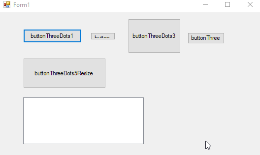

# WaitingButton
Winform button that shows three dots on click.


Lightweight, quick and dirty animated c# winform waiting button.  For advanced functionality look into using something like [telerik waiting bar](https://docs.telerik.com/devtools/winforms/controls/track-and-status-controls/waitingbar/waiting-styles).


# Example




# Code Example

```cs
using System.Windows.Forms;
using Majorsilence.Winforms.WaitingButton;

namespace Majorsilence.Winforms.WaitingButton.Test
{
    public partial class Form1 : Form
    {
        private Majorsilence.Winforms.WaitingButton.ButtonThreeDots buttonThreeDots5;

        public Form1()
        {
            InitializeComponent();

            this.buttonThreeDots5 = new Majorsilence.Winforms.WaitingButton.ButtonThreeDots();  
            this.buttonThreeDots5.Click += new System.EventHandler(this.TheImportantPart); 
            this.Controls.Add(this.buttonThreeDots5);
        }

        
        private async void TheImportantPart(object sender, EventArgs e)
        {
            buttonThreeDots5.DisplayCharacter = "ಠ_ಠ";
            buttonThreeDots5.DarkColor = Color.DarkBlue;
            buttonThreeDots5.LightColor = Color.Cyan;

            await Task.Run(async () =>
            {
                // Fake background task
                await Task.Delay(5000);
                this.Invoke((MethodInvoker)delegate
                {
                    buttonThreeDots5.Reset();
                });
            });
        }
    }
}
```
